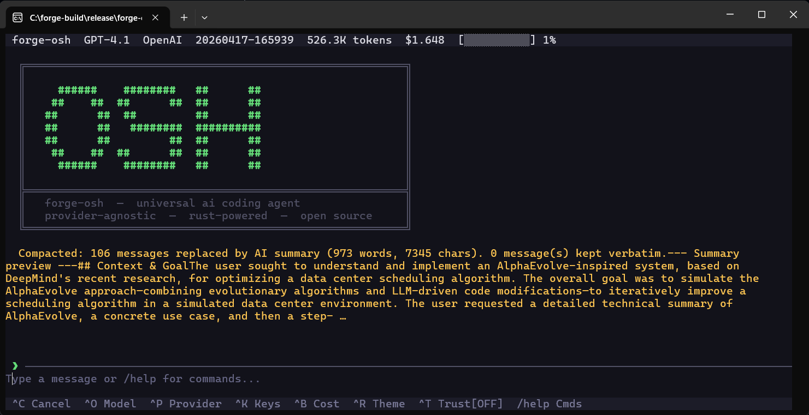

# 🛠️ forge-osh (Open Source Harness)

<div align="center">
  <h3>The Universal, Provider-Agnostic Coding Agent for the Terminal</h3>
  <p>An autonomous AI coding assistant that works with <strong>any LLM provider</strong> — cloud or local.<br/>
  Built in Rust for speed. Designed for developers who live in the terminal.</p>
  <br/>
  <code>v1.0.16</code> &nbsp;·&nbsp;
  <strong>MIT License</strong> &nbsp;·&nbsp;
  <a href="mailto:omamitshah@gmail.com">Request Binary</a>
</div>

---

<p align="center">
  <br>
  <br>
  <br>
  <br>
  <br>
  <br>
  <br>
  <br>
  
</p>

## 📑 Table of Contents

1.  [Project Vision](#-project-vision)
2.  [Key Features at a Glance](#-key-features-at-a-glance)
3.  [Tech Stack & Architecture](#-tech-stack--architecture)
4.  [Getting the Application](#-getting-the-application)
5.  [Quick Start Guide](#-quick-start-guide)
6.  [Supported LLM Providers](#-supported-llm-providers)
7.  [Agent Tool Suite (40+ Tools)](#-agent-tool-suite-40-tools)
8.  [The Agentic Loop & Planning](#-the-agentic-loop--planning)
9.  [Terminal User Interface (TUI)](#-terminal-user-interface-tui)
10. [Slash Commands](#-slash-commands)
11. [Keyboard Shortcuts](#-keyboard-shortcuts)
12. [Permission Rules System](#-permission-rules-system)
13. [Hooks System](#-hooks-system)
14. [Memory System (CLAUDE.md)](#-memory-system-claudemd)
15. [Session Management](#-session-management)
16. [Context Window & Token Management](#-context-window--token-management)
17. [File Undo System](#-file-undo-system)
18. [Git Worktree Isolation](#-git-worktree-isolation)
19. [Semantic Code Graph (forge-graph)](#-semantic-code-graph-forge-graph)
20. [CLI Commands Reference](#-cli-commands-reference)
21. [Configuration Reference](#-configuration-reference)
22. [Environment Variables](#-environment-variables)
23. [v1.0.15 — Architecture & Skills Overhaul](#-v1015--architecture--skills-overhaul)
    - [Permission Modes](#permission-modes-plan--accept-edits--bypass--default)
    - [Extended Thinking](#extended-thinking-thinkingconfig)
    - [Tool Executor Rewrite](#tool-executor-rewrite)
    - [JSON-Schema Input Validation](#json-schema-input-validation)
    - [Cancellation Tokens & Ctrl+C](#cancellation-tokens--ctrlc-semantics)
    - [Tool Concurrency](#tool-concurrency-is_concurrency_safe)
    - [File-State Cache](#file-state-cache-sha-256-fingerprinting)
    - [Tiktoken Token Counting](#tiktoken-token-counting)
    - [Compaction Rewrite](#compaction-rewrite--structured-prompt--scaled-budget)
    - [Expanded Hooks Lifecycle](#expanded-hooks-lifecycle)
    - [Failure Circuit-Breaker](#failure-circuit-breaker)
    - [Fuzzy `--resume` & Session Browser](#fuzzy---resume--session-browser)
    - [Skills Architecture](#skills-architecture-project--user--bundled)
    - [Skills UX — Commands & Status Bar](#skills-ux--commands--status-bar)
    - [How to Use, Add, Modify & Delete Skills](#how-to-use-add-modify--delete-skills)
24. [Future Roadmap](#-future-roadmap)
25. [Contributing](#-contributing)
26. [License & Contact](#-license--contact)

---

## 🎯 Project Vision

**`forge-osh`** was created to give developers a lightning-fast, native AI coding assistant that runs entirely inside the terminal — no Electron apps, no browser tabs, no vendor lock-in.

- **Use Any LLM**: Bring your own keys. Anthropic, OpenAI, Gemini, Groq, xAI, OpenRouter, DeepSeek, or run models locally with Ollama. Switch providers mid-conversation with a single keystroke.
- **True Agentic Autonomy**: The agent doesn't just chat. It reads files, writes code, runs shell commands, manages Git, searches the web, fixes its own errors, and loops until the task is complete.
- **Uncompromised Safety**: Every destructive action (writes, deletes, shell commands) goes through a permission system. Wildcard allow/deny rules persist across sessions so you're never nagged for the same `git commit` twice.
- **Single Binary, Zero Dependencies**: One compiled executable. Works on Windows, macOS, and Linux. No Python, no Node, no Docker required.

---

## ✨ Key Features at a Glance

| Category | Feature |
|---|---|
| **Providers** | 12+ cloud providers, 6 local providers, auto-detection of local models |
| **Tools** | 40+ tools: file I/O, shell, Git (14 ops), search, web, code quality, tasks, notebooks, worktrees |
| **Agent** | Autonomous plan-execute-observe loop with `enter_plan_mode` / `exit_plan_mode` |
| **TUI** | 5 color themes, Vim normal mode, mouse scroll, conversation history, modal pickers |
| **Safety** | Per-tool permission rules with glob patterns, blocked-command lists, trust mode |
| **Sessions** | Auto-save, named sessions, resume, export to Markdown |
| **Context** | LLM-based context compaction, token counting, cost tracking in real-time |
| **Undo** | File snapshot stack — undo any agent mutation instantly with `/undo` |
| **Hooks** | Shell hooks on `PreToolUse`, `PostToolUse`, `Stop`, `Notification` events |
| **Memory** | Auto-loads `CLAUDE.md` files from project, parent dirs, and `~/.forge-osh/` |
| **Code Graph** | `/forge-graph` builds a full semantic code graph — deterministic O(1) symbol lookup for the agent, token-efficient codebase navigation |

---

## 🏗️ Tech Stack & Architecture

| Layer | Technology |
|---|---|
| **Language** | [Rust](https://www.rust-lang.org/) 2021 Edition |
| **Async Runtime** | [Tokio](https://tokio.rs/) (full features) |
| **Terminal UI** | [Ratatui](https://ratatui.rs/) + [Crossterm](https://github.com/crossterm-rs/crossterm) |
| **CLI Parsing** | [Clap](https://docs.rs/clap) v4 with derive macros |
| **HTTP** | [Reqwest](https://docs.rs/reqwest) with Rustls TLS + SSE streaming |
| **Tokenization** | [tiktoken-rs](https://docs.rs/tiktoken-rs) for accurate token counting |
| **Serialization** | [Serde](https://serde.rs/) + JSON + TOML + [Bincode](https://docs.rs/bincode) (graph artifact) |
| **Code Graph** | [Petgraph](https://docs.rs/petgraph) `StableGraph` + [Rayon](https://docs.rs/rayon) parallel parsing |
| **Code Quality** | [Syntect](https://docs.rs/syntect) for syntax highlighting, [Similar](https://docs.rs/similar) for diff generation |
| **Error Handling** | [thiserror](https://docs.rs/thiserror) typed errors + [Anyhow](https://docs.rs/anyhow) |
| **Logging** | [Tracing](https://docs.rs/tracing) with environment filtering |

### Architecture Overview

```
┌──────────────┐   ┌──────────────┐   ┌──────────────────┐
│   CLI/TUI    │──▶│   App Core   │──▶│  Provider Router  │
│  (Ratatui)   │   │  (app.rs)    │   │ (12+ clouds, 6+  │
│              │   │              │   │  local detected)  │
└──────────────┘   └──────┬───────┘   └──────────────────┘
                          │
              ┌───────────┼───────────┐
              │           │           │
      ┌───────┴──┐  ┌─────┴────┐ ┌───┴────────┐
      │  Agent   │  │ Sessions │ │   Config    │
      │  Loop    │  │ History  │ │  Keyring    │
      │ Planner  │  │ Tokens   │ │  Models DB  │
      │ Context  │  │ Checkpt  │ │  Hooks      │
      │ Compact  │  └──────────┘ │  Permissions│
      │ Hooks    │               └─────────────┘
      │ Perms    │
      └───┬──────┘
          │
    ┌─────┴──────────────────────────────────┐
    │           Tool Registry (40+)          │
    ├────────────┬────────────┬──────────────┤
    │ File I/O   │ Git (14)   │ Shell/PS     │
    │ Search     │ Web (2)    │ Code Quality │
    │ Tasks (5)  │ Agent (3)  │ Notebooks    │
    │ Worktree(3)│ graph_query│              │
    └────────────┴────────────┴──────────────┘
          │
    ┌─────┴──────────────────────────────────┐
    │       Semantic Code Graph (opt.)       │
    ├────────────┬────────────┬──────────────┤
    │ petgraph   │ Two-pass   │ Bincode      │
    │ StableGraph│ parallel   │ artifact     │
    │ 3 indices  │ builder    │ persistence  │
    └────────────┴────────────┴──────────────┘
```

---

## 📥 Getting the Application

### Method 1: Request a Pre-Built Binary (Easiest)

If you don't have Rust or Cargo installed and don't want to set them up, simply **email [omamitshah@gmail.com](mailto:omamitshah@gmail.com)** with your operating system (Windows/macOS/Linux) and architecture (x64/ARM). You'll receive a compiled `forge-osh` executable ready to run — no build tools needed.

### Method 2: Download from GitHub Releases

Visit the **[Releases](https://github.com/OmShah74/forge-osh/releases)** page on GitHub and download the pre-compiled archive for your platform:

| Platform | File |
|---|---|
| Windows (x64) | `forge-osh-windows-amd64.zip` |
| macOS (Apple Silicon) | `forge-osh-macos-arm64.tar.gz` |
| macOS (Intel) | `forge-osh-macos-amd64.tar.gz` |
| Linux (x64) | `forge-osh-linux-x86_64.tar.gz` |

Extract the archive and place the binary in a directory on your `PATH`.

### Method 3: Install from Source (via Cargo)

Requires [Rust](https://rustup.rs/) (1.75+).

```bash
git clone https://github.com/OmShah74/forge-osh.git
cd forge-osh
cargo install --path .
```

### Method 4: Build from Source (Custom Target Directory)

```powershell
# Windows (PowerShell)
$env:PATH = "$env:USERPROFILE\.cargo\bin;C:\msys64\mingw64\bin;$env:PATH"
$env:CARGO_TARGET_DIR = "C:\forge-build"
cargo build --release
# Binary → C:\forge-build\release\forge-osh.exe
```
```bash
# Linux / macOS
cargo build --release
# Binary → target/release/forge-osh
```

---

## ⚡ Quick Start Guide

### 1. Set Up an API Key

```bash
# Option A: Interactive first-run setup (guided wizard)
forge-osh

# Option B: Direct CLI key management
forge-osh config keys set anthropic sk-ant-api-xxxxxxxxxxxx

# Option C: Environment variable (ephemeral)
export ANTHROPIC_API_KEY=sk-ant-api-xxxxxxxxxxxx
```

### 2. Launch the Agent

```bash
# Interactive TUI mode
forge-osh

# Non-interactive single-task mode
forge-osh "Fix the null pointer exception in src/handler.rs"

# Pipe mode (feed logs, code, or errors via stdin)
cat build_errors.log | forge-osh "Diagnose and fix these build errors"

# Specify a provider and model for this session
forge-osh -p groq -m llama-3.3-70b-versatile "Refactor the auth module"

# Resume the last session
forge-osh --resume

# Start or resume a named session
forge-osh --session feature-auth-refactor
```

---

## ☁️ Supported LLM Providers

### Cloud Providers (12)

| Provider | Env Variable | Default Model |
|---|---|---|
| **Anthropic** | `ANTHROPIC_API_KEY` | `claude-sonnet-4-20250514` |
| **OpenAI** | `OPENAI_API_KEY` | `gpt-4o` |
| **Google Gemini** | `GEMINI_API_KEY` | `gemini-2.0-flash` |
| **Groq** | `GROQ_API_KEY` | `llama-3.3-70b-versatile` |
| **xAI (Grok)** | `XAI_API_KEY` | `grok-3` |
| **OpenRouter** | `OPENROUTER_API_KEY` | `anthropic/claude-sonnet-4-20250514` |
| **Mistral** | `MISTRAL_API_KEY` | `mistral-large-latest` |
| **DeepSeek** | `DEEPSEEK_API_KEY` | `deepseek-chat` |
| **Together AI** | `TOGETHER_API_KEY` | `meta-llama/Llama-3.3-70B-Instruct-Turbo` |
| **Fireworks** | `FIREWORKS_API_KEY` | `llama-v3p3-70b-instruct` |
| **Perplexity** | `PERPLEXITY_API_KEY` | `sonar-pro` |
| **Cohere** | `COHERE_API_KEY` | `command-r-plus` |

### Local Providers (6) — Auto-Detected

`forge-osh` probes common local ports at startup and automatically adds any running local inference server.

| Provider | Default URL | Auto-detect |
|---|---|---|
| **Ollama** | `http://localhost:11434` | ✅ |
| **LM Studio** | `http://localhost:1234` | ✅ |
| **llama.cpp** | `http://localhost:8080` | ✅ |
| **vLLM** | `http://localhost:8000` | ✅ |
| **Jan** | `http://localhost:1337` | ✅ |
| **LocalAI** | `http://localhost:8080` | ✅ |

---

## 🧰 Agent Tool Suite (40+ Tools)

### File System Operations (8 tools)

| Tool | Permission | Description |
|---|---|---|
| `read_file` | ReadOnly | Read file content with optional line ranges |
| `write_file` | Mutating | Write an entire file (new or overwrite) |
| `edit_file` | Mutating | Surgical find-and-replace edits (preferred over `write_file`) |
| `create_file` | Mutating | Create a new file (errors if exists) |
| `delete_file` | Destructive | Delete a file with confirmation |
| `list_directory` | ReadOnly | List directory contents |
| `move_file` | Mutating | Move or rename files |
| `copy_file` | Mutating | Copy files |

Every mutating file operation automatically **snapshots** the file before modifying it, enabling `/undo`.

### Shell Execution (2 tools)

| Tool | Permission | Description |
|---|---|---|
| `bash` | Varies | Run any shell command. Read-only commands (`ls`, `cat`, `grep`, `git log`) are **auto-allowed**. |
| `powershell` | Varies | Run PowerShell commands (Windows). `Get-*` cmdlets are auto-allowed. |

Configurable timeouts (default: 30s, max: 300s) and a blocked-commands list prevent accidental damage.

### Git Operations (14 tools)

| Tool | Permission | Description |
|---|---|---|
| `git_status` | ReadOnly | Working tree status |
| `git_diff` | ReadOnly | Diff with options (staged, file-specific) |
| `git_log` | ReadOnly | Commit history with formatting |
| `git_blame` | ReadOnly | Line-by-line blame |
| `git_show` | ReadOnly | Show commit contents |
| `git_add` | Mutating | Stage files |
| `git_commit` | Mutating | Create commits |
| `git_branch` | Mutating | Create/list branches |
| `git_checkout` | Mutating | Switch branches |
| `git_stash` | Mutating | Stash changes |
| `git_reset` | Destructive | Reset HEAD |
| `git_fetch` | Network | Fetch from remotes |
| `git_push` | Network | Push to remotes |
| `git_pull` | Network | Pull from remotes |

### Search & Navigation (2 tools)

| Tool | Description |
|---|---|
| `search_files` | Grep-based content search with context lines, file type filters, and output modes |
| `find_files` | Glob-pattern file discovery across the entire project tree |

### Web (2 tools)

| Tool | Description |
|---|---|
| `web_fetch` | Fetch a URL and return content as text (HTML auto-converted to readable text) |
| `web_search` | Search the web via DuckDuckGo — returns titles, URLs, and snippets |

### Code Quality (3 tools)

| Tool | Description |
|---|---|
| `run_linter` | Run the project's linter (auto-detects: ESLint, Clippy, Pylint, etc.) |
| `run_tests` | Run the project's test suite |
| `run_formatter` | Run the project's formatter (Prettier, rustfmt, Black, etc.) |

### Task Management (5 tools)

| Tool | Description |
|---|---|
| `todo_write` | Write a structured TODO list to `.forge-osh/todos.md` with statuses and priorities |
| `task_create` | Create a tracked in-session task |
| `task_update` | Update a task's status (`pending` → `in_progress` → `completed` / `failed`) |
| `task_get` | Retrieve details of a specific task by ID |
| `task_list` | List all tasks in the session, optionally filtered by status |

### Agent Orchestration (3 tools)

| Tool | Description |
|---|---|
| `ask_user` | Pause the agent loop and present a clarifying question to the user |
| `enter_plan_mode` | Switch to planning mode — agent proposes a plan before executing |
| `exit_plan_mode` | Exit planning mode and proceed with execution |

### Jupyter Notebooks (1 tool)

| Tool | Description |
|---|---|
| `notebook_read` | Parse `.ipynb` files and display cells (code, markdown, outputs) as formatted text |

### Git Worktrees (3 tools)

| Tool | Description |
|---|---|
| `enter_worktree` | Create an isolated git worktree for experimental or risky changes |
| `exit_worktree` | Remove a worktree after the experiment concludes |
| `list_worktrees` | List all worktrees, marking which ones were created in this session |

### Semantic Code Graph (1 tool)

| Tool | Permission | Description |
|---|---|---|
| `graph_query` | ReadOnly | Query the pre-built semantic code graph. Returns "no graph loaded" gracefully if no artifact exists. Supports `find`, `context_pack`, `blast_radius`, `file_graph`, `mutations`, and `stats` operations. |

---

## 🔄 The Agentic Loop & Planning

`forge-osh` operates in an autonomous **plan-execute-observe** loop:

1. **Understand** — Read relevant files and context before acting
2. **Plan** — For complex tasks, the agent enters `plan_mode` and presents its strategy
3. **Execute** — Make targeted edits, run commands, verify with tests
4. **Observe** — Check results, fix errors, iterate
5. **Report** — Summarize what was done and flag any issues

The **Planner** module uses heuristics to detect complex tasks (words like "refactor", "migrate", "build", requests longer than 30 words) and auto-enters plan mode.

---

## 🖥️ Terminal User Interface (TUI)

### Layout

The TUI is a full-screen terminal application with four panes:
- **Header Bar**: Shows active model, provider, session name, token count, cost, theme, and trust mode status
- **Conversation View**: Scrollable, syntax-highlighted conversation with user, assistant, and tool messages
- **Input Box**: Multi-line text input with history support
- **Status Bar**: Displays all available keyboard shortcuts and scroll position

### Color Themes (5 built-in)

Cycle themes live with `Ctrl+R` or `/theme [name]`:

| Theme | Description |
|---|---|
| `dark` | Default dark theme |
| `light` | Light background for bright environments |
| `dracula` | Purple-accented Dracula palette |
| `nord` | Cool blue-grey Nord palette |
| `solarized` | Warm Solarized palette |

### Vim Normal Mode

Press `Esc` to enter Vim normal mode for keyboard-only navigation:
- `j` / `k` — Scroll down/up 3 lines
- `d` / `u` — Scroll half-page down/up
- `g` / `G` — Jump to top / bottom
- `i` / `a` — Return to insert mode

---

## 💬 Slash Commands

Type these at the prompt and press Enter:

### General
| Command | Description |
|---|---|
| `/help` | Show the full help overlay |
| `/clear` | Clear the conversation display |
| `/quit`, `/exit` | Exit forge-osh |
| `/new` | Start a fresh conversation |
| `/save` | Save session to disk |
| `/session` | Show current session info |

### Model & Provider
| Command | Description |
|---|---|
| `/model` | Open model selector picker |
| `/model list` | List all available models for the current provider |
| `/model <id>` | Switch to a model directly by ID |
| `/provider` | Open provider selector picker |
| `/keys` | Open the API key manager |

### Agent Control
| Command | Description |
|---|---|
| `/trust` | Toggle trust mode (skip all permission prompts) |
| `/vim` | Toggle Vim normal mode |
| `/fast` | Toggle fast mode (optimized output) |
| `/compact` | Run LLM-based context compaction (summarize old messages) |
| `/undo` | Undo the last file modification made by the agent |
| `/effort <1-5>` | Set response effort level |
| `/copy` | Copy last assistant response to clipboard |
| `/permissions` | View/edit permission rules |

### Git & Export
| Command | Description |
|---|---|
| `/commit` | Generate an AI commit message for staged changes |
| `/diff [staged]` | Show git diff statistics |
| `/export [file.md]` | Export the full conversation to Markdown |

### Diagnostics
| Command | Description |
|---|---|
| `/cost` | Show token usage and cost breakdown |
| `/status` | Full system status (provider, model, context %, cost) |
| `/doctor` | Environment diagnostics (git, shell, API keys, config health) |
| `/resume` | List saved sessions for resuming |

### Semantic Code Graph
| Command | Description |
|---|---|
| `/forge-graph` | Build a semantic code graph for the current project and save as a `.bin` artifact |
| `/forge-graph rebuild` | Force a full graph rebuild (discards existing artifact) |
| `/forge-graph status` | Show graph info: node count, edge count, build time, file count |
| `/forge-graph query <name>` | Search the graph for a symbol by name |
| `/forge-graph clear` | Remove the artifact file and unload the graph from memory |

---

## ⌨️ Keyboard Shortcuts

### Global & Navigation
| Shortcut | Action |
|---|---|
| `Ctrl+C` | Cancel / interrupt agent |
| `Ctrl+D` | Exit (empty input) |
| `Ctrl+L` | Clear conversation |
| `Esc` | Close modal / enter Vim mode |

### Prompt Input
| Shortcut | Action |
|---|---|
| `Enter` | Submit prompt |
| `Shift+Enter` | Insert new line |
| `Ctrl+A` / `Ctrl+E` | Cursor to start / end |
| `Ctrl+U` | Delete to start of line |
| `Ctrl+W` | Delete previous word |
| `Up` / `Down` | Navigate prompt history |

### Quick Actions
| Shortcut | Action |
|---|---|
| `Ctrl+O` | Open **Model Picker** |
| `Ctrl+P` | Open **Provider Picker** |
| `Ctrl+K` | Open **API Key Manager** |
| `Ctrl+B` | Show **Token & Cost Info** |
| `Ctrl+R` | **Cycle Color Theme** |
| `Ctrl+T` | Toggle **Trust Mode** |
| `Ctrl+S` | Save session |
| `Ctrl+N` | New session |
| `Ctrl+X` | Export session |

### Scrolling
| Shortcut | Action |
|---|---|
| `Shift+Up/Down` | Scroll 3 lines |
| `PgUp` / `PgDn` | Scroll 10 lines |
| `Mouse Wheel` | Scroll 3 lines |
| `Ctrl+Home` | Jump to top |
| `Ctrl+End` | Jump to bottom (re-enables auto-scroll) |

### Confirmation Dialogs
| Key | Action |
|---|---|
| `Y` / `Enter` | Allow once |
| `N` / `Esc` | Deny |
| `A` | Always allow (saves as rule) |
| `T` | Enable trust mode |

---

## 🔒 Permission Rules System

`forge-osh` uses a wildcard-based permission rules system stored in `~/.forge-osh/permissions.json`. Rules are persistent across sessions.

### Format

```
tool_name(pattern)
```

### Managing Rules

```
/permissions                          — view all rules
/permissions add bash(git *)          — auto-allow all git commands
/permissions add bash(cargo *)        — auto-allow all cargo commands
/permissions add read_file(*)         — auto-allow all file reads
/permissions add edit_file(/src/*)    — auto-allow edits under /src/
/permissions deny bash(rm -rf *)      — auto-deny rm -rf commands
/permissions remove <index>           — remove a rule by index
```

### Evaluation Order

1. **Deny rules** are checked first (always win)
2. **Allow rules** are checked second
3. If no rule matches → user is prompted
4. **ReadOnly tools** (`read_file`, `list_directory`, `search_files`) never prompt
5. **Trust mode** bypasses all prompts

---

## 🪝 Hooks System

Define shell commands that fire at specific agent lifecycle events. Configure in `~/.forge-osh/hooks.json`:

```json
{
  "PreToolUse": [
    { "matcher": "bash", "command": "echo 'Running: $TOOL_INPUT'" }
  ],
  "PostToolUse": [
    { "matcher": "*", "command": "echo 'Tool $TOOL_NAME done (error=$IS_ERROR)'" }
  ],
  "Stop": [
    { "command": "notify-send 'forge-osh task complete'" }
  ]
}
```

**Environment variables** available in hook commands:
- `TOOL_NAME` — name of the tool (e.g. `bash`)
- `TOOL_INPUT` — JSON-serialized tool input
- `TOOL_OUTPUT` — tool output (`PostToolUse` only)
- `IS_ERROR` — `"1"` if tool errored (`PostToolUse` only)

Each hook has a configurable timeout (default: 10 seconds).

---

## 🧠 Memory System (CLAUDE.md)

`forge-osh` automatically loads `CLAUDE.md` files into the system prompt, giving the agent persistent project knowledge:

| Location | Scope |
|---|---|
| `./CLAUDE.md` | Project-level instructions (coding standards, architecture notes) |
| `~/.forge-osh/CLAUDE.md` | User-level preferences (global across all projects) |
| `~/.claude/CLAUDE.md` | Compatible with Claude Code memory files |
| Parent directories | Checked from working dir up to home |

Write instructions like "Always use TypeScript strict mode" or "Test framework is pytest" and the agent will follow them in every session.

---

## 💾 Session Management

- **Auto-save**: Sessions are automatically saved to `~/.local/share/forge-osh/sessions/`
- **Named sessions**: `forge-osh --session my-feature` creates or resumes a named session
- **Resume**: `forge-osh --resume` picks up the last session
- **Export**: `/export report.md` exports the full conversation to Markdown
- **List & Delete**: `forge-osh sessions list` and `forge-osh sessions delete <id>`

Each session records: provider, model, full message history, timestamps, and token usage.

---

## 📊 Context Window & Token Management

### Real-Time Tracking

The header bar shows live token count and cost. Press `Ctrl+B` or type `/cost` for a detailed breakdown.

### LLM-Based Context Compaction

When the conversation approaches the model's context limit (configurable, default: 80%), `forge-osh` uses the active LLM itself to produce a **dense, lossless summary** of the older messages. This summary replaces the dropped messages as a single context block, preserving:

- Files read, created, modified, or deleted
- Key decisions and reasoning
- Current task state and next steps
- Errors encountered and resolutions
- Important variable names, IDs, and branch names

Trigger manually with `/compact` or let it auto-trigger at the configured threshold.

---

## ↩️ File Undo System

Every time the agent modifies a file (`write_file`, `edit_file`, `create_file`, `delete_file`), a **snapshot** of the original file content is pushed onto a global stack.

- Type `/undo` to immediately restore the last modified file to its previous state.
- If the agent created a new file, `/undo` deletes it.
- If the agent modified an existing file, `/undo` restores the original content byte-for-byte.
- Multiple `/undo` calls walk back through the entire stack.

---

## 🌿 Git Worktree Isolation

When the agent needs to perform risky refactors or experiments, it can create an isolated **git worktree**:

```
Agent: I'll create a worktree for this experimental refactor.
[Tool: enter_worktree] path: .worktree/experiment, branch: forge-worktree-1234
```

The main working tree stays untouched. If the experiment succeeds, changes can be merged. If it fails, the worktree is trivially removed with `exit_worktree`.

---

## 🕸️ Semantic Code Graph (forge-graph)

`forge-osh` v1.0.8 ships with an optional but powerful **semantic code graph** engine. Once built, the agent uses it for deterministic, O(1) symbol lookup instead of spending tokens on file searches.

### How It Works

```
/forge-graph          ← you type this once
       │
       ▼
┌──────────────────────────────────────────────┐
│          Two-Pass Parallel Builder           │
│                                              │
│  Pass 1 (parallel, rayon):                  │
│    For every source file → regex parse       │
│    → collect defs, imports, calls            │
│                                              │
│  Pass 2 (sequential):                        │
│    Insert file nodes + symbol nodes          │
│    Resolve edges (Contains, Calls,           │
│    Imports, MutatesState, …)                 │
└──────────────────┬───────────────────────────┘
                   │
                   ▼
        petgraph StableGraph
    ┌──────────────────────────┐
    │  3 in-memory indices:    │
    │  fqdn_index  (O(1))      │
    │  file_index  (by path)   │
    │  name_index  (by name)   │
    └────────────┬─────────────┘
                 │  bincode serialize
                 ▼
     forge_graph_<dirname>.bin     ← reloaded automatically on next launch
```

### Supported Languages

| Language | Definitions Parsed | Imports | Call Graph |
|---|---|---|---|
| **Rust** | `fn`, `struct`, `enum`, `trait`, `impl`, `macro_rules!`, `mod`, `type`, `static`, `const` | `use` statements | function/method calls |
| **Python** | `def`, `class`, `async def` | `import`, `from ... import` | function calls |
| **JavaScript / TypeScript** | `function`, `class`, `const/let/var` arrows, `interface`, `type`, `enum` | `import`, `require()` | function calls |
| **Go** | `func`, `type struct`, `type interface`, `var`, `const` | `import` blocks | function calls |

### Node & Edge Types

**Node kinds**: `File`, `Module`, `Class`, `Struct`, `Enum`, `EnumVariant`, `Function`, `Method`, `Trait`, `Interface`, `Impl`, `GlobalVar`, `TypeAlias`, `Macro`, `Field`, `ExternalStub`

**Edge types**: `Contains`, `Defines`, `Calls`, `Instantiates`, `Returns`, `ReadsState`, `MutatesState`, `Implements`, `Inherits`, `Imports`, `ExternalDependency`

### graph_query Operations

The agent uses the `graph_query` tool automatically when a graph is loaded:

```jsonc
// Find any symbol by name
{ "operation": "find", "target": "MyStruct" }

// Get full context with transitive dependencies, within a token budget
{ "operation": "context_pack", "target": "src/agent/loop.rs::AgentLoop::run", "token_budget": 4000 }

// Blast radius — what breaks if you change this symbol?
{ "operation": "blast_radius", "target": "src/graph/types.rs::GraphNode" }

// All symbols defined in a file
{ "operation": "file_graph", "target": "src/tui/mod.rs" }

// All mutation points for a variable / field
{ "operation": "mutations", "target": "scroll_top" }

// Graph statistics
{ "operation": "stats" }
```

### Context Pack Algorithm

The `context_pack` operation uses a **token-budget BFS** to intelligently pack context:

1. Start from the primary node (full snippet)
2. BFS outward: callers → callees → containers → implementors
3. For each candidate: include full snippet if budget allows, degrade to `signature_only` otherwise
4. Return structured `PackedContext` with primary node + dependency list + truncation notice

This avoids burning thousands of tokens reading whole files — the agent gets exactly the context it needs.

### Artifact & Persistence

- Artifact: `forge_graph_<sanitized-dirname>.bin` stored next to the forge-osh executable
- Auto-loaded on startup if a matching artifact exists
- Version-stamped (`GRAPH_VERSION = 1`) — stale artifacts from old builds are detected and rejected
- Background build: the TUI remains responsive during graph construction; progress messages stream into the conversation display
- Fully **optional**: if no artifact exists, forge-osh behavior is identical to previous versions

---

## 🐝 Multithread Swarm Architecture & Recent Enhancements (v1.0.10 - v1.0.13+)

Starting from version 1.0.10 through 1.0.13, `forge-osh` received a major series of professional-grade architectural upgrades. These updates focus on context preservation, default model reliability, graceful execution management, and primarily, a completely new optional **Multithreaded Swarm Architecture** inspired by enterprise-grade agent harnesses.

### 1. The Coordinator-Worker Swarm Pattern (v1.0.13)

By default, `forge-osh` operates in a serial, **monolithic loop** — you ask a question, the agent plans, tools execute sequentially, and you get a final answer. While highly reliable, this can be slow for tasks that can be parallelized (e.g., researching three different API endpoints while simultaneously writing boilerplate code).

To solve this, v1.0.13 introduces the **Coordinator-Worker Swarm Architecture**.

#### How to Enable Multithreading
The multithreaded architecture is **100% opt-in** and completely preserves the existing stable monolithic workflow when turned off.
- Type `/multithread` (or `/mt`) in the prompt to toggle the Swarm mode on.
- The UI will explicitly notify you that subsequent prompts prefixed with `@worker` will spawn parallel background agents.
- When toggled off, the application seamlessly reverts to the standard linear execution model without any configuration overhead or restarts required.

#### What is a Worker?
A **Worker** is a self-contained, lightweight LLM execution unit operating on its own dedicated `tokio` asynchronous operating system thread. 
- **Isolated Memory:** Each worker maintains its own completely independent `ConversationHistory`. When a worker searches the web or executes tools, its tool calls and message history do not pollute your main visual conversation thread.
- **Independent Context Windows:** Workers do not share tokens. You can spawn a worker to read a massive 100K-token log file, and it will not consume the token budget of your main chat session snippet.
- **Trust Mode Authorization:** Because workers are authorized by the user via the Coordinator, they automatically run in **Trust Mode**, executing their toolchains without prompting you for `Y/n` confirmations.

#### Spawning and Managing Workers
When multithreading is ON, pinging a worker is as simple as tagging your prompt:
```text
@worker Deep dive into the Albot Video RAG ingestion pipeline and document the extraction logic.
```
Immediately, the Coordinator intercepts this, spawns the worker in the background, and gives control of the input line right back to you. You can immediately continue chatting with the monolithic loop or spawn additional workers:
```text
@worker Find out why the Windows build is complaining about missing MSYS2 dependencies.
@worker Write a python script to parse the nginx error logs in the /scratch directory.
```

The Coordinator manages these parallel threads via a message-passing Event Bus:
- **`⚡ Worker Spawned`**: The TUI notifies you as soon as the background thread spins up.
- **`Worker Tool Signals`**: In real-time (and quietly), you'll see brief indicators (e.g., `[worker-5b2a] running read_file...`) letting you know the background agent is actively working.
- **`✅ Worker Completed`**: Once the worker succeeds, it pushes its final summarized report directly to your main chat view. It also reports its independent token consumption (`Worker tokens: 1240 in / 850 out`).
- **`❌ Worker Failed`**: If a worker runs out of iterations or hits an API error, it gracefully halts and reports the exact failure stack trace to the coordinator without crashing your session.

#### Swarm Control Commands
You have full granular control over the swarm via dedicated commands:
- `/multithread status`: Lists all currently executing workers, their unique `uuid` hashes, and the truncated description of what task they are currently solving.
- `/multithread stop`: Broadcasts an abort signal (via tokio `JoinHandle::abort()`) to gracefully instantly kill all background workers running in the swarm.

---

### 2. Intelligent Context Compaction Rewrite (v1.0.10)

Earlier versions of the agent occasionally ran into truncations where issuing a `/compact` command would blindly strip the context window down to the last 16 messages without understanding semantic relevance. 

v1.0.10 entirely rewrote the Context Compaction engine:
- The system now uses LLM-powered dynamic summarization of historical message chains.
- Instead of raw slicing (which orphaned `ToolCall` and `ToolResult` pairs, leading to API rejection errors), the compaction system strips orphaned IDs automatically via a strict validation pass.
- By configuring `auto_summarize_at` in `config.toml`, the system will proactively trigger this dense summarization protocol seamlessly when your context window usage reaches 80%, guaranteeing you never hit a hard token wall mid-generation.

### 3. Smart Default Overrides & Provider Enhancements (v1.0.11)

To provide the absolute best out-of-the-box experience:
- The default provider router logic has been upgraded to prioritize **OpenAI** with `gpt-4o` if API keys are comprehensively available, superseding older faulty default cascades.
- Full support for the bleeding-edge OpenAI pathways has been integrated, including `gpt-4.1` (and `o1` architectures) for tasks requiring deep reasoning before output.
- Auto-routing now seamlessly falls back downward (e.g., Claude → GPT → Gemini) without hard-crashing if a specific endpoint experiences a timeout or rate-limit violation.

### 4. Graceful Execution Abortion (v1.0.12)

A major UX limitation in monolithic CLI tools is the inability to cancel a long-running generation short of killing the entire process architecture (which destroys unsaved history and token tracking metrics).

- **True `Ctrl+C` Interrupts:** The application now intercepts standard `SIGINT` signals correctly inside the TUI loop. 
- Pressing `Ctrl+C` while the agent is thinking (or spinning on a massive file read block) now gracefully aborts *only* the `tokio` sub-task running the agent loop.
- **Partial Stream Preservation:** Any partially streamed text generated before the abort signal was sent is captured, formatted, and permanently committed to the conversation history alongside a `[Execution cancelled by user]` tag.
- The UI spinner halts instantly, and control of the raw input line is immediately released back to the user without dropping the overall `forge-osh` application.

---

## 🛠️ CLI Commands Reference

```bash
# Configuration & Keys
forge-osh config keys set <provider> <key>   # Set API key
forge-osh config keys list                   # List configured keys
forge-osh config keys remove <provider>      # Remove a key
forge-osh config set <key> <value>           # Set a config value
forge-osh config get <key>                   # Get a config value

# Models & Providers
forge-osh providers list                     # List active providers
forge-osh providers test <provider>          # Test provider connection
forge-osh models list                        # List all available models
forge-osh models list groq                   # List models for a provider
forge-osh models set <provider> <model>      # Set default model

# Sessions
forge-osh sessions list                      # List saved sessions
forge-osh sessions export <id>               # Export session to Markdown
forge-osh sessions delete <name>             # Delete a session
forge-osh --session <name>                   # Start/Resume named session
forge-osh --resume                           # Resume the last session

# Execution Modes
forge-osh "your prompt here"                 # Single-task mode
echo "input" | forge-osh                     # Pipe mode
forge-osh --trust                            # Trust mode (no confirmations)
forge-osh --no-tools                         # Chat-only mode (no tools)
forge-osh --verbose                          # Enable debug logging
forge-osh --no-color                         # Disable all colors
forge-osh --theme dracula                    # Set color theme
```

---

## ⚙️ Configuration Reference

All configuration lives in `~/.forge-osh/config.toml`. Created automatically on first run with sane defaults.

```toml
[general]
theme = "dark"                    # dark | light | solarized | dracula | nord
default_provider = "anthropic"
trust_mode = false                # Skip permission prompts globally
auto_save_sessions = true
max_session_history = 100
verbose = false
system_prompt_extra = ""          # Appended to every system prompt

[agent]
max_tokens = 8192
temperature = 0.7
max_tool_iterations = 50          # Max loop iterations before forced exit
planning_mode = true              # Auto-plan for complex tasks
auto_summarize_at = 0.8           # Context compaction at 80% usage
max_output_per_tool = 50000       # Truncate long tool outputs

[tools.bash]
timeout_seconds = 30
max_timeout_seconds = 300
blocked_commands = ["rm -rf /", "sudo rm -rf /", "mkfs", ":(){:|:&};:"]

[tools.web]
enabled = true
timeout_seconds = 15
max_content_length = 50000

[ui]
show_token_count = true
show_cost = true
show_spinner = true
syntax_highlight = true
diff_before_apply = true          # Show diffs before applying edits
compact_tool_output = true
max_conversation_lines = 1000
```

---

## 🌐 Environment Variables

| Variable | Description |
|---|---|
| `FORGE_PROVIDER` | Override default provider |
| `FORGE_MODEL` | Override default model |
| `FORGE_TRUST` | `1` = trust mode (skip all prompts) |
| `FORGE_THEME` | Override UI theme |
| `FORGE_NO_COLOR` | `1` = disable all colors |
| `FORGE_CONFIG_DIR` | Override config directory (`~/.forge-osh/`) |
| `FORGE_DATA_DIR` | Override data directory (`~/.local/share/forge-osh/`) |
| `ANTHROPIC_API_KEY` | Anthropic API key |
| `OPENAI_API_KEY` | OpenAI API key |
| `GEMINI_API_KEY` | Google Gemini API key |
| `GROQ_API_KEY` | Groq API key |
| `XAI_API_KEY` | xAI (Grok) API key |
| `OPENROUTER_API_KEY` | OpenRouter API key |
| `MISTRAL_API_KEY` | Mistral API key |
| `DEEPSEEK_API_KEY` | DeepSeek API key |
| `TOGETHER_API_KEY` | Together AI API key |
| `FIREWORKS_API_KEY` | Fireworks API key |
| `PERPLEXITY_API_KEY` | Perplexity API key |
| `COHERE_API_KEY` | Cohere API key |

---

## 🧬 v1.0.15 — Architecture & Skills Overhaul

Version 1.0.15 is the largest single-release hardening pass the codebase has seen: a top-to-bottom re-plumbing of the tool execution pipeline, a rewrite of compaction, a new permission-mode system, and a brand-new Skills subsystem that lets you bundle, share, invoke, and author reusable workflows the agent can call by name. Everything below is shipped and live in the binary — each subsection names the files touched so you can read the code directly.

> **Why this matters**: every earlier release assumed "one agent, one loop, one tool at a time, trust the LLM to validate its own inputs, keep a rough char-count for tokens." Those assumptions were all replaced with real primitives — concurrency-safe tools, JSON-schema validation, precise BPE token counting, a file-state cache that detects external edits, first-class permission modes, extended thinking, cancellation tokens, and structured compaction. The Skills system then sits on top of all of this.

---

### Permission Modes (`Plan` / `AcceptEdits` / `Bypass` / `Default`)

Previously the harness had a single boolean `trust_mode`. That binary choice is now a four-state machine modelled after Claude Code's permission model.

| Mode | Effect |
|---|---|
| `Default` | ReadOnly tools auto-allow. Everything else prompts — or is auto-allowed by a persistent `PermissionStore` rule. |
| `Plan` | **ReadOnly tools only.** Every mutating/shell/network/destructive tool is hard-denied with an explanatory message. The agent is also told to exit plan mode via `exit_plan_mode` when it has a plan to present. |
| `AcceptEdits` | File mutations (`write_file` / `edit_file` / `create_file`) auto-approve. Destructive, Shell, and Network tools still prompt. Perfect for guided refactor sessions. |
| `Bypass` | All tools auto-approve. Same effect as the legacy `trust_mode`. |

**How to switch**:
```
/mode <plan|accept-edits|bypass|default>
/plan             # shortcut for /mode plan
/accept-edits     # shortcut
/bypass           # shortcut
/default          # shortcut
```

The current mode is embedded in the system prompt so the LLM itself understands the restrictions (e.g., under `Plan` it is told "You may ONLY use ReadOnly tools").

**Files**: `src/types.rs` (`PermissionMode` enum), `src/tools/executor.rs` (`decide_permission` layered logic), `src/agent/loop.rs` (system-prompt injection), `src/tui/mod.rs` (slash commands).

---

### Extended Thinking (`ThinkingConfig`)

Anthropic's extended-thinking API is now a first-class knob.

```
/think              # toggle thinking on/off
/think 8000         # set a token budget (integer)
```

`ChatRequest` carries a `thinking: ThinkingConfig` field that flows through the provider layer. The Anthropic provider wires it into the API call (`thinking: { type: "enabled", budget_tokens: N }`) and forces `temperature = 1.0` as required. Non-Anthropic providers ignore it.

**Files**: `src/types.rs` (`ThinkingConfig`), `src/provider/anthropic.rs`.

---

### Tool Executor Rewrite

The tool executor went from a thin dispatch helper into a real gate. It now performs five distinct stages per tool call:

1. **Cancellation check** — honours the agent-level `CancellationToken` before it starts expensive work.
2. **JSON-schema validation** — validates `ToolCall.input` against the tool's declared `parameters_schema()` via the `jsonschema` crate (Draft-7). Bad inputs short-circuit with a readable error instead of reaching the tool.
3. **Effective permission level** — asks the tool for its permission level given the specific input (e.g. `bash("ls")` is less dangerous than `bash("rm -rf /")`).
4. **Layered permission decision** — `Bypass > Skill-scope > Plan > ReadOnly > PermissionStore > AcceptEdits > Ask` (see next section).
5. **Structured-span tracing** — every execution is wrapped in a `tracing::instrument` span so you get end-to-end tool telemetry when tracing is enabled.

**Files**: `src/tools/executor.rs`, `src/tools/validate.rs`.

---

### JSON-Schema Input Validation

A new `tools/validate.rs` module uses the `jsonschema` crate with explicit Draft-7 validation. The error list is capped at 5 entries so a broken input produces a concise diagnostic. If the schema itself fails to compile (a tool authoring bug), validation returns `Ok` rather than blocking real work — a graceful-degradation posture.

This catches entire classes of provider hallucinations (e.g. an LLM inventing a `files` argument that was never in the schema) **before** the tool touches disk.

---

### Cancellation Tokens & Ctrl+C Semantics

`AgentLoop` now holds an `Arc<parking_lot::RwLock<CancellationToken>>`. Ctrl+C in the TUI does three things atomically:

1. Calls `.read().cancel()` on the current token to abort in-flight provider streams, tool executions, and backoff sleeps.
2. Emits an "aborted" event to the TUI.
3. Installs a fresh token via `.write()` so the next turn isn't born cancelled.

Every provider call, tool execution, and backoff-sleep is wrapped in `tokio::select!` against the token — no more hung turns when the user changes their mind.

**Files**: `src/agent/loop.rs` (`cancel_current_turn`, `reset_cancel`, `cancel_token`), `src/tui/mod.rs` (Ctrl+C handler).

---

### Tool Concurrency (`is_concurrency_safe`)

Previously, if the LLM returned four `read_file` calls in one assistant turn, they ran strictly serially. Now:

```rust
fn is_concurrency_safe(&self) -> bool { false }  // default — opt-in
```

`ReadFileTool`, `ListDirectoryTool`, `task_get`, `task_list` and other side-effect-free tools opt in. The loop partitions tool calls into `safe` (run via `join_all`) and `serial` (run sequentially, preserving ordering for the LLM). Result order is preserved so the LLM sees the tool_results in the order it requested them.

**Files**: `src/tools/mod.rs` (trait default), `src/tools/fs.rs`, `src/tools/tasks.rs`, `src/agent/loop.rs` (`execute_tool_calls` partition).

---

### File-State Cache (SHA-256 fingerprinting)

A new `FileStateCache` at `src/session/file_cache.rs` maintains SHA-256 fingerprints + mtime for every file the agent reads. Before a write/edit, the cache checks that the on-disk content still matches the last read — if not, the mutation is refused with a message telling the agent to re-read before editing. This eliminates the entire class of "agent overwrote your manual edit" bugs.

- `record_read(path, content)` — called by `read_file` on success
- `check_unchanged(path)` — called by `write_file` / `edit_file` before mutating
- `record_write(path, content)` — called after a successful mutation
- `invalidate(path)` — called by `delete_file`

The cache is session-scoped (`Arc<FileStateCache>` on `AgentLoop`) and threaded through `ToolContext.file_cache`.

---

### Tiktoken Token Counting

The previous estimator was `chars / 4`. It was inaccurate enough that cost numbers were unreliable and the auto-compact trigger fired either too early or too late. Replaced with `tiktoken_rs::cl100k_base` behind a `OnceLock` so the BPE tables are built once per process.

- `count_tokens(text)` — precise BPE counting
- `count_request(messages, system)` — pre-flight request-size estimate used by the context manager

**Files**: `src/session/tokens.rs`.

---

### Compaction Rewrite — Structured Prompt + Scaled Budget

Three specific auto-compact failures were all fixed together:

1. **"Invalid model" errors after `/model` switch** — compaction used to read `session.model_id`, which was set at session creation and never updated. Auto-compact now always reads `router.active_model_id()` and `router.active()` so the user-visible provider is used.
2. **Two-to-three-line summaries that erased context** — the summarizer prompt is now a mandatory 7-section structure (Context & Goal, Files Touched, Key Decisions, Commands Run, Errors & Resolutions, Identifiers, Current State & Next Step). Target length is scaled to the transcript size (`target_min_words`/`target_max_words` clamped to `[250, 1500]` / `[400, 3500]`). If the transcript is >2000 chars and the summary comes back <80 words or <400 chars, it's rejected with an error so the fallback-truncation path can run.
3. **TUI showed "removed N messages" but didn't delete them** — a new `AgentEvent::HistoryCompacted { kept, removed, summary_preview, succeeded }` event bridges the loop-level compaction to the TUI. The TUI now drains its rendered message pane and refreshes the context-% bar immediately.

`DEFAULT_KEEP_LAST = 0` (no 16-message minimum) so the summarizer sees the full transcript. `max_tokens_budget` scales from 1500 to 8000 based on transcript size.

**Files**: `src/agent/compaction.rs`, `src/agent/loop.rs`, `src/tui/mod.rs` (`drain_rendered_for_compaction`, `refresh_context_display`), `src/session/history.rs`.

---

### Expanded Hooks Lifecycle

The hooks system now fires on seven events (was three):

| Event | Fires when |
|---|---|
| `PreToolUse` | Before every tool call. Can veto by returning non-zero exit. |
| `PostToolUse` | After every tool call. Observes output. |
| `Stop` | When the agent's turn ends normally. |
| `Notification` | When a permission prompt is raised. |
| `UserPromptSubmit` | **NEW** — Before the user's prompt is submitted. Can veto the entire turn. |
| `SessionStart` | **NEW** — When a session begins (fresh or resumed). |
| `SessionEnd` | **NEW** — When a session exits. |
| `PreCompact` | **NEW** — Before auto-compaction runs. Useful for external archiving. |

A `blocking` field was added to `HookEntry`: when `true`, the hook's exit status gates the event. Non-blocking hooks run fire-and-forget. `stdout`/`stderr` are captured so hook veto reasons can be surfaced in the TUI.

**Files**: `src/agent/hooks.rs`.

---

### Failure Circuit-Breaker

If the same tool fails three times in a row on the same input (typically `edit_file` on a file whose contents drifted), the loop injects a circuit-breaker message instructing the agent to read the current file contents and use `write_file` to replace the whole thing. Breaks the "retry the same broken edit forever" pattern that kills turns on long sessions.

**Files**: `src/agent/loop.rs` (`ConsecutiveFailureTracker`).

---

### Fuzzy `--resume` & Session Browser

```
forge-osh --resume                 # load most recent
forge-osh --resume <uuid>          # exact session id
forge-osh --resume <prefix>        # id prefix match
forge-osh --resume <name>          # exact name match
```

Implemented as a three-tier match in `src/app.rs`: exact id → id prefix → name. The `/resume` slash command opens an interactive session browser that lets you navigate sessions with arrow keys and load/delete via Enter/Del.

**Files**: `src/cli.rs` (`resume: Option<String>` with `default_missing_value = "__latest__"`), `src/app.rs`.

---

## Skills Architecture (project / user / bundled)

Skills are **reusable named workflows** — markdown files with YAML frontmatter that tell the agent *how* to do something (debug a regression, review a diff, refactor safely, capture project memory). When a skill is invoked, its body becomes a materialized prompt injected into the conversation, and the session enters a **skill scope** that can narrow which tools are allowed for the duration.

### Three sources, clear precedence

Skills are discovered from three locations, with strict precedence:

| Source | Location | Precedence |
|---|---|---|
| **Project** | `./.claude/skills/<name>/SKILL.md` | Highest — overrides everything |
| **User** | `~/.forge-osh/skills/<name>/SKILL.md` | Middle — personal skills across projects |
| **Bundled** | Compiled into the binary (`src/skills/bundled/*.md`) | Lowest — safe fallbacks |

A project skill named `review` fully replaces the bundled `review` skill — no merging. This lets teams check project-specific skills into `./.claude/skills/` alongside the code.

### The four bundled skills

Ships with the binary, always available, can be overridden by creating a project/user skill with the same name:

- **`debug`** — Structured debugging workflow for reproducing issues and isolating root causes
- **`review`** — Review changes for bugs, regressions, and missing tests before shipping
- **`refactor`** — Plan and apply safe refactors while preserving behavior and verifying each step
- **`project-memory`** — Capture durable project guidance into `CLAUDE.md` without overwriting existing intent

### Skill file format (SKILL.md)

```markdown
---
name: deploy-helper
description: Shown in /skills and in the agent's system prompt
when_to_use: Triggers the agent looks for before invoking
allowed_tools:
  - read_file
  - bash
  - git_diff
model: claude-sonnet-4-6        # optional: override the conversation model
execution_mode: inline            # inline (default) or fork
user_invocable: true              # false hides from /skills picker
hooks:                            # optional per-skill hooks
  PreToolUse:
    - matcher: bash
      command: echo "running in deploy-helper scope"
  Stop:
    - matcher: "*"
      command: notify-send "deploy helper finished"
---

# deploy-helper

Describe the workflow here. This body becomes the materialized prompt injected
when the skill is invoked. Use ${ARGS} to reference any arguments passed as
`/skill deploy-helper <args>`. Use ${FORGE_SESSION_ID} and ${FORGE_SKILL_DIR}
for session/skill introspection.
```

### Execution modes

- **`inline`** (default) — The skill body is injected into the *current* conversation. The session enters a skill scope: tools outside `allowed_tools` are hard-denied at the executor layer (`executor.rs::decide_permission` stage 1.5). Scope clears when the agent's turn ends.

- **`fork`** — The skill runs in an isolated `Worker` (separate conversation history, separate system prompt). The worker's result is spliced back into the main conversation as a `[Skill Result: <name>]` message. The main loop is **not** blocked — the worker is spawned via `tokio::spawn`.

### How the LLM discovers skills

When `agent.skills_enabled = true` and `agent.include_skills_in_system_prompt = true` (both default), the system prompt contains:

```
## Skills
The following skills are available. When one matches the task, use the
`invoke_skill` tool instead of re-inventing the workflow.
- `debug` — Structured debugging workflow... Use when: the user needs bug diagnosis.
- `review` — Review changes for bugs... Use when: the user asks for a review.
...
```

The LLM calls `invoke_skill { skill: "debug", args: "null pointer in parser" }`. The tool returns the materialized prompt as its content (so the LLM receives the full workflow text). In inline mode, the loop also installs a scope that narrows tool access. In fork mode, a worker is spawned.

### Skill scope enforcement

When an inline skill is active, the permission decision order becomes:

1. **Bypass mode** → always allow
2. **Skill scope allowlist** → deny tools not in `allowed_tools`
3. **Plan mode** → allow only ReadOnly
4. ReadOnly tools → allow
5. `PermissionStore` rule → allow / deny
6. **AcceptEdits** → auto-allow Mutating tools
7. Otherwise → ask

An empty `allowed_tools: []` is treated as "no restriction." A non-empty list narrows enforcement.

### Internal types

| Type | Role |
|---|---|
| `SkillDefinition` | Parsed skill (frontmatter + body + source + path) |
| `SkillRegistry` | In-memory collection of parsed skills |
| `SharedSkillRegistry` | `Arc<RwLock<SkillRegistry>>` — hot-reloadable, thread-safe |
| `ActiveSkillScope` | Current scope (allowlist + model override + hooks + mode) on the `Session` |
| `SkillInvocationRecord` | Persisted history of invocations on the session (capped at 32) |
| `InvokeSkillTool` | The `invoke_skill` tool the LLM calls |
| `AgentEvent::SkillScopeChanged` | Broadcast to TUI when scope enters/exits |

**Files**: `src/skills/mod.rs`, `src/skills/bundled/*.md`, `src/tools/skills.rs`, `src/session/mod.rs` (`active_skill_scope`, `invoked_skills`), `src/types.rs` (`ToolContext.active_skill_scope`, `ToolContext.skill_registry`), `src/agent/loop.rs` (`apply_special_tool_effects`), `src/agent/system_prompt.rs` (skill listing).

---

## Skills UX — Commands & Status Bar

The Skills subsystem is fully interactive from inside the TUI. Nothing requires leaving the terminal or hand-editing JSON.

### Slash commands

```
/skills                        List all skills (grouped by source, active marked ●)
/skill <name> [args]           Invoke a skill. Hot-reloads registry first.
/skill show <name>             Print the skill's frontmatter summary + full body
/skill new <name>              Scaffold ./.claude/skills/<name>/SKILL.md and open $EDITOR
/skill edit <name>             Open an existing skill in $EDITOR
/skill delete <name>           Remove a project skill directory (bundled cannot be deleted)
/skill reload                  Force re-scan of all three skill directories
/skill path                    Print the three search paths
/skill off                     Clear the currently-active skill scope
```

Aliases: `/skill clear` = `/skill off`, `/skill rm` = `/skill delete`, `/skill refresh` = `/skill reload`.

### Status-bar indicator

When any skill scope is active (whether from an LLM-triggered `invoke_skill` or a user-typed `/skill <name>`), the status bar gains a `🪄 <skill-name>` indicator. It appears immediately and clears when the turn ends or when `/skill off` is typed. The indicator is driven by the new `AgentEvent::SkillScopeChanged { name: Option<String> }` event so TUI state never drifts from session state.

### Tab-completion

Tab now autocompletes skill names in four contexts:

```
/skill rev<Tab>           → /skill review
/skill show re<Tab>       → /skill show review
/skill edit deb<Tab>      → /skill debug
/skill delete dep<Tab>    → /skill delete deploy-helper
```

On multiple matches it extends to the common prefix and prints the full candidate list as a system message.

### The `/skills` pretty list

Instead of the old flat dump, `/skills` now groups by source and marks the active skill:

```
Available skills (7):

[bundled]
  /skill debug                  Structured debugging workflow...
                                ↳ use when: the user needs bug diagnosis.
  /skill refactor               Plan and apply safe refactors...
  /skill review                 Review changes for bugs, regressions...  ● ACTIVE
  /skill project-memory         Capture durable project guidance...

[user]
  /skill my-commit-style        Commit message formatting I like...

[project]
  /skill deploy-helper          Deploys this service to staging...
  /skill review                 Project override of the bundled reviewer

Subcommands: /skill <name> [args] | show | new | edit | delete | reload | path | off
```

### Configuration knobs

```toml
# ~/.forge-osh/config/config.toml
[agent]
skills_enabled = true                      # master switch
include_skills_in_system_prompt = true     # show skills to the LLM
max_skill_listed_in_prompt = 12            # cap on how many skills are listed
```

Set `skills_enabled = false` to fully disable the subsystem (no system-prompt listing, `/skill` and `/skills` report disabled, `invoke_skill` tool still registered but disabled skills can't be invoked).

---

## How to Use, Add, Modify & Delete Skills

A practical walkthrough. Everything below works from inside the running TUI.

### 1. See what's available

```
/skills
```

Output is grouped by source (bundled / user / project) with descriptions and any active marker. If nothing matches, you'll see a message pointing to the two writeable skill directories and instructions to run `/skill new <name>`.

### 2. Invoke a skill two ways

**You invoke it explicitly:**
```
/skill review
/skill debug "null pointer in parser.rs"
```
Args are passed via `${ARGS}` substitution inside the skill body. The registry is refreshed on every invocation so any edit you made seconds ago applies without a manual reload.

**The agent invokes it autonomously:**
When you describe a task that matches a skill's `description` + `when_to_use`, the LLM calls the `invoke_skill` tool on its own. You'll see `🪄 <name>` appear in the status bar. The skill scope auto-clears when the agent's turn ends.

### 3. Create a new skill

```
/skill new deploy-helper
```

This:
1. Creates `./.claude/skills/deploy-helper/SKILL.md` with a complete starter template (name, description, when_to_use, allowed_tools, execution_mode, user_invocable, and a markdown body scaffold)
2. Opens it in `$EDITOR` (falls back to `$VISUAL`, then `notepad` on Windows, `vi` on Unix)
3. Refreshes the shared registry so the skill is discoverable immediately

Edit the file:
- Tighten `description` and `when_to_use` — these are what the LLM sees and uses to decide whether to invoke the skill
- Narrow `allowed_tools` to just what the workflow needs — this is a real safety boundary
- Pick `execution_mode: inline` for skills that should continue the current conversation, `fork` for skills that should run in isolation

Save and exit. Invoke with `/skill deploy-helper`.

### 4. Modify an existing skill

```
/skill edit deploy-helper
```

Opens the file in `$EDITOR`. After save, the next `/skill <name>` invocation picks up the change automatically (or run `/skill reload` to refresh explicitly).

**Editing bundled skills**: the bundled versions are compiled into the binary and cannot be edited in place. But you can **shadow** them: `/skill new review` creates a project-level `review` that fully overrides the bundled one. Copy the bundled body as a starting point by running `/skill show review` first and pasting the output.

### 5. Inspect a skill before invoking

```
/skill show debug
```

Prints the frontmatter summary (description, source, path, allowed_tools, mode) and the full markdown body. This is exactly what the agent will receive when the skill is invoked — no hidden transformation.

### 6. Delete a project skill

```
/skill delete deploy-helper
```

Removes `./.claude/skills/deploy-helper/` entirely. Bundled skills cannot be deleted (they live in the binary), but a project override can be deleted and the bundled version takes back over.

### 7. Leave a skill scope early

If the agent has entered an inline skill scope and you want to release the tool-allowlist restriction before the turn finishes:

```
/skill off
```

Clears `session.active_skill_scope`, removes the status-bar indicator, and emits a `SkillScopeChanged { name: None }` event.

### 8. Find where skills live

```
/skill path
```

Prints the three paths the loader scans. Useful for checking in project skills via Git (commit `./.claude/skills/`) or syncing user skills across machines (rsync `~/.forge-osh/skills/`).

### 9. Author a skill — best practices

- **Be specific in `description`** — this is what the LLM reads to decide whether to invoke
- **Write `when_to_use` as triggers, not tutorials** — e.g., "the user mentions a failing test" is better than "use this for debugging"
- **Narrow `allowed_tools`** — start with the minimum and widen only when the workflow demands it
- **Prefer `inline` over `fork`** — inline participates in the conversation, fork starts cold with only the skill body as context
- **Use `${ARGS}`, `${FORGE_SESSION_ID}`, `${FORGE_SKILL_DIR}`** in the body for dynamic content
- **Check your skill into version control** at the project level so the team benefits
- **Promote stable skills to user-level** at `~/.forge-osh/skills/` so every project gets them
- **Test with `/skill <name>`** before trusting the agent to find them — if `/skill show` looks right, the system prompt will show the LLM the same text

### 10. Config gates

```toml
[agent]
skills_enabled = true                   # master on/off
include_skills_in_system_prompt = true  # let the LLM auto-invoke
max_skill_listed_in_prompt = 12
```

Turn off `include_skills_in_system_prompt` if you want skills to be usable manually (via `/skill <name>`) but invisible to the LLM's autonomous selection.

---

## 🔮 Future Roadmap

1. **Advanced Code Generation & Diff Handling**
   - AST-aware code modifications instead of string replacement
   - Interactive unified diff preview before applying changes
   - Multi-file edit transactions with atomic rollback

2. **Token Usage & Context Optimization**
   - ✅ Semantic code graph with context-pack BFS (shipped v1.0.8)
   - Prompt caching integration (Anthropic, OpenAI)
   - Aggressive auto-summarization to reduce cost and latency

3. **Intelligent Checkpoint Structure**
   - Local state-machine checkpointing with timeline branching
   - Visually step back to any successful checkpoint and fork a new path
   - Similar to a localized Git tree for AI task history

4. **Next-Gen TUI Improvements**
   - Split-pane layouts with file preview alongside conversation
   - Floating modal windows and mini-maps for large file context
   - Richer visualization of the agent's internal thought process

5. **Non-Terminal Integrations & IDE Plugins**
   - Native integrations for VS Code, Cursor, and Antigravity as an agentic chat pane
   - Desktop companion application for visual-first workflows
   - REST API server mode for integration with custom tooling

---

## 🤝 Contributing

Contributions are welcome! Please:

1. Open an issue to discuss the change before large PRs
2. Run `cargo fmt` and `cargo clippy` before submitting
3. Add tests for new features (run the suite with `cargo test`)
4. Follow the existing code style and module structure

---

## 📄 License & Contact

This project is licensed under the **MIT License**.

**Author**: Om Shah  
**Email**: [omamitshah@gmail.com](mailto:omamitshah@gmail.com)  
**Repository**: [github.com/OmShah74/forge-osh](https://github.com/OmShah74/forge-osh)

> 💡 **Don't want to build from source?** Email [omamitshah@gmail.com](mailto:omamitshah@gmail.com) with your OS and architecture, and I'll send you a compiled binary directly.
