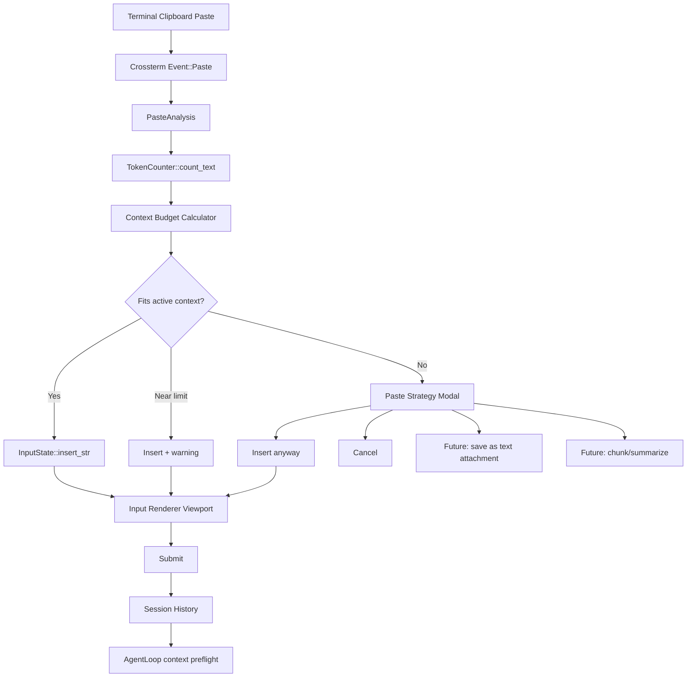

# Future Plan 01: Robust Clipboard Text Paste And Long-Input Handling

## Scope

This report covers the text side of clipboard/paste handling only. Image clipboard support should be designed later because it requires changes to message types, provider adapters, storage, rendering, and model capability routing.

Goal: allow users to paste large text blocks into the input panel safely, preserve multiline text exactly, estimate whether it fits the active model context window, and avoid UI freezes or accidental early submission.

## Current-State Findings

### Input Storage

- `src/tui/input.rs` stores prompt text in `InputState { text: String, cursor: usize, history, history_index, multiline }`.
- Editing is byte-index based but cursor updates use UTF-8 character widths, so normal Unicode insertion/deletion is mostly safe as long as cursor remains on char boundaries.
- There is no explicit paste API in `InputState`; pasted content currently arrives only as repeated `KeyCode::Char` events if the terminal emits it that way.
- `InputState::submit()` returns the entire `text` string, pushes it into local history, clears input, and the TUI then sends it to `AgentLoop::run(text)`.

### Event Handling

- `src/tui/mod.rs` imports `crossterm::event::Event`, `KeyCode`, `KeyEventKind`, and maps only `Event::Key` and other existing events.
- There is no handling for `Event::Paste(String)`.
- There is no terminal setup for bracketed paste mode visible in the current TUI flow.
- Plain pasted newlines may be reported as Enter key events in some terminals if bracketed paste is not enabled. That can submit partial pasted text accidentally.

### Rendering

- `src/tui/renderer.rs` computes input height from content but clamps it to a maximum of 8 rows:
  - `let input_height = (input_lines + 2).max(3).min(8) as u16;`
- `render_input()` renders the full input text in a `Paragraph` with wrapping but does not maintain an input scroll offset.
- For very long input, older lines disappear above the 8-row input box with no way to scroll inside the input area.
- Cursor Y is clamped to the bottom of the input panel, so long-input cursor feedback can become misleading.

### Context Handling

- When the user submits a normal message, the TUI displays it and calls `AgentLoop::run(text)`.
- `AgentLoop::run()` adds the user message to session history before checking context budget.
- If the newly pasted text pushes the context above the summarization threshold, auto-compaction can run before the provider call.
- With `DEFAULT_KEEP_LAST = 0`, auto-compaction may summarize the just-pasted large text into a compact summary instead of letting the model analyze the full pasted text.
- If the pasted text itself is larger than the model context window, no system can truly “fit the entire thing” into that model call. The correct behavior must be explicit: either reject, ask to switch models, chunk, save as an attached text artifact, summarize, or perform retrieval/chunked analysis.

## Current Limitations

1. No robust paste event support.
2. Multiline paste can be accidentally submitted line-by-line on terminals that emit newline as Enter.
3. Large paste can freeze or lag because every character may trigger individual insertion and redraw.
4. Input UI has no internal viewport or scroll.
5. No token estimate is shown before submit.
6. No paste-size policy exists.
7. No distinction exists between “typed prompt text” and “large pasted reference material”.
8. Auto-compaction can fight the user's intent to analyze the full pasted text.
9. Input history may store huge pasted blobs, bloating `input_history.json`.

## Correct Architectural Principle

A pasted long text should not be treated exactly like typed input. It should become a structured input artifact with metadata:

- Source: clipboard paste.
- Size: bytes, chars, lines, estimated tokens.
- Mode: inline in user message, text attachment, chunked document, or rejected as too large.
- Context strategy: fit directly, ask user, switch model, chunk, summarize, or RAG-style retrieval.

For the first implementation, keep the message model text-only but introduce a paste pipeline so future image/attachment support has a clean path.

## Proposed Design

### Layer 1: Terminal Paste Capture

Add bracketed paste mode during TUI startup and disable it on shutdown.

Expected implementation points:

- In TUI initialization near raw-mode/mouse setup, execute:
  - `crossterm::event::EnableBracketedPaste`
- In cleanup, execute:
  - `crossterm::event::DisableBracketedPaste`
- Add `Event::Paste(text)` handling in the main event loop before `Event::Key`.

Rationale:

- Bracketed paste lets multiline clipboard content arrive as one paste event.
- It prevents pasted newlines from acting like Enter/Submit.
- It allows one batch insertion and one redraw.

### Layer 2: InputState Bulk Insert

Add a method:

```rust
pub fn insert_str(&mut self, text: &str) {
    self.text.insert_str(self.cursor, text);
    self.cursor += text.len();
}
```

This is safe if `self.cursor` is maintained as a char boundary, which current editing methods do. Add tests for:

- ASCII paste.
- Unicode paste.
- Multiline paste.
- Paste in middle of existing text.

### Layer 3: Paste Policy And Token Preflight

Introduce a `PastePolicy` and `PasteAnalysis`:

```rust
pub struct PasteAnalysis {
    pub chars: usize,
    pub bytes: usize,
    pub lines: usize,
    pub estimated_tokens: u32,
    pub context_limit: u32,
    pub available_tokens_estimate: u32,
    pub recommendation: PasteRecommendation,
}

pub enum PasteRecommendation {
    InsertInline,
    InsertInlineWithWarning,
    AskForStrategy,
    RejectTooLarge,
}
```

Use `TokenCounter::count_text()` for token estimate. Compare against:

- Active provider context window.
- Current session history estimate.
- System prompt estimate.
- Tool definitions estimate if tools are enabled.
- Configured response reserve, e.g. `max_tokens`.

Do not merely compare pasted tokens to raw context window. The usable budget is:

```text
available_for_new_user_text =
    active_context_window
    - estimated_system_prompt_tokens
    - estimated_existing_history_tokens
    - estimated_tool_schema_tokens
    - max_output_tokens_reserved
    - safety_margin
```

### Layer 4: User Experience For Large Paste

For small and medium paste:

- Insert directly into input.
- Show a status message such as:
  - `Pasted 14.2k chars / ~3.7k tokens.`

For paste near budget:

- Insert but show warning:
  - `Pasted text may use 78% of current context. Consider /compact or a larger model.`

For paste exceeding budget:

- Do not blindly insert or auto-submit.
- Open a modal with choices:
  - `Insert anyway`
  - `Save as text attachment for chunked analysis`
  - `Summarize first`
  - `Cancel`

For the first text-only milestone, the modal can be simplified:

- `Insert anyway`
- `Cancel`

But the architecture should leave room for text attachments.

### Layer 5: Input Viewport

Add input-local scrolling:

```rust
pub input_scroll_top: usize
```

or keep it inside `InputState`.

Rendering should show only the visible window of input lines when content exceeds 8 rows. Cursor movement should adjust the input viewport so the cursor remains visible.

Required actions:

- Add input scroll calculation based on wrapped lines.
- Keep main conversation scroll separate from input scroll.
- Add optional keybindings for input viewport:
  - Alt+Up/Down or Ctrl+Up/Down for input scrolling.
  - Avoid breaking current Shift+Up/Down conversation scrolling.

### Layer 6: Large Input History Guard

Do not persist huge pasted content into `input_history.json` by default.

Suggested policy:

- Keep normal prompts under a threshold, e.g. 20k chars.
- For larger prompts, store a compact marker:
  - `[large pasted prompt omitted from input history: 183k chars]`
- Or store only first/last N chars.

This avoids accidental config/data bloat.

## Architecture Diagram



## Files Likely To Change Later

- `src/tui/input.rs`
  - Add `insert_str`, maybe input viewport state, paste tests.
- `src/tui/mod.rs`
  - Enable/disable bracketed paste.
  - Handle `Event::Paste`.
  - Add paste-analysis modal state.
- `src/tui/renderer.rs`
  - Render input viewport and paste warning/modal.
- `src/session/tokens.rs`
  - Possibly add request-budget helper.
- `src/agent/loop.rs`
  - Add preflight that distinguishes new long user input from older history compaction.
- `src/types.rs`
  - Future: add text/image attachment content types.
- `src/tui/help.rs`
  - Document paste behavior and limits.
- `src/agent/system_prompt.rs`
  - Later update prompt to explain how large pasted text is represented.

## Interaction With Existing Compaction

The main bug to avoid: a user pastes a huge document and asks the model to analyze it, but auto-compaction immediately replaces it with a summary before the first analysis call.

Recommended solution:

- Add a “fresh user message protection” rule in context management.
- If the latest user message alone causes overflow, do not auto-compact it away.
- Instead surface an actionable error/modal:
  - `This paste is ~180k tokens and cannot fit in the active 128k model. Choose chunked analysis, switch model, or summarize first.`

## Test Strategy Without Disk Bloat

Run only focused unit tests:

- `cargo test --lib tui::input`
- `cargo test --lib session::tokens`
- Add paste-analysis unit tests that do not create large binaries beyond normal lib-test binary.

Avoid full integration suite unless CI requires it.

Manual smoke tests:

1. Paste 1k chars single-line.
2. Paste 20k chars multiline.
3. Paste Unicode text with emojis and non-Latin scripts.
4. Paste text containing slash commands; ensure it is inserted, not executed, until submitted.
5. Paste text containing many newlines; ensure no premature submit.
6. Paste text near context limit; verify warning.
7. Paste text over context limit; verify modal/guard.

## Caveats

- Terminal paste support varies. Bracketed paste works in modern terminals but should degrade gracefully.
- Windows Terminal + PowerShell behavior must be tested explicitly.
- Token estimates are approximate across providers, but `tiktoken-rs` is better than chars/4.
- Rendering very large strings can still cost CPU; viewport rendering must avoid repeatedly wrapping the entire text on every frame if input becomes very large.

## System Prompt Maintenance

When implemented, update `src/agent/system_prompt.rs` to clarify:

- Large clipboard text may arrive as direct user text or future text attachments.
- The model should not assume omitted attachment chunks are in context.
- If text is chunked, the model must use provided chunk tools or summaries instead of pretending it saw the whole original.
- When a user asks to analyze pasted text, prioritize preserving exact user-provided content and warn when the active context cannot contain it.

