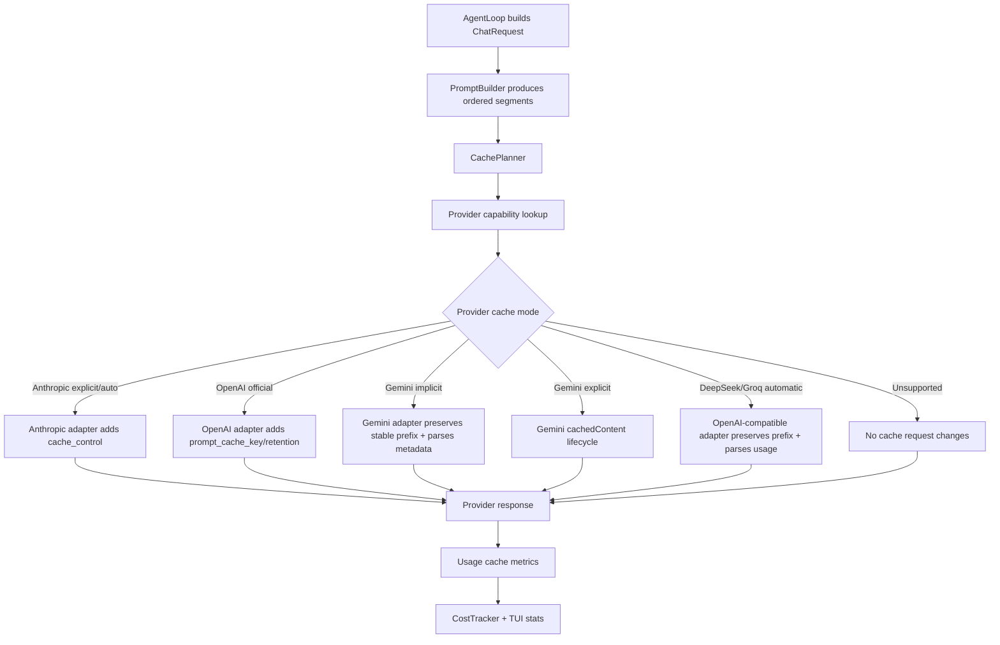

# Future Plan 02: Prompt Caching Across Providers

## Scope

This report covers prompt/context caching for provider requests. It does not implement caching yet. It proposes a provider-aware architecture that improves latency and cost without breaking model routing, conversation integrity, tool calling, compaction, skills, or workers.

## External Source Notes

Official provider documentation shows that caching behavior is provider-specific:

- OpenAI prompt caching is automatic for prompts of at least 1024 tokens, exposes `cached_tokens`, and supports `prompt_cache_key` plus optional retention configuration in supported APIs. Source: https://platform.openai.com/docs/guides/prompt-caching
- Anthropic/Claude supports prompt caching with `cache_control`, including automatic top-level caching and explicit breakpoints. It caches `tools`, `system`, and `messages` in that order. Source: https://docs.anthropic.com/en/docs/build-with-claude/prompt-caching
- Gemini supports implicit caching on Gemini 2.5 and newer models and explicit cached content APIs for many models. Source: https://ai.google.dev/gemini-api/docs/caching/
- DeepSeek context caching is enabled by default and works on overlapping prefixes. Source: https://api-docs.deepseek.com/guides/kv_cache/
- Groq prompt caching is automatic only for supported models and exposes cached token information in usage. Source: https://console.groq.com/docs/prompt-caching

## Current-State Findings

### Current Request Shape

`src/types.rs` defines:

```rust
pub struct ChatRequest {
    pub model: String,
    pub messages: Vec<Message>,
    pub tools: Option<Vec<ToolDefinition>>,
    pub max_tokens: u32,
    pub temperature: f32,
    pub system: Option<String>,
    pub stop_sequences: Vec<String>,
    pub thinking: ThinkingConfig,
}
```

No cache policy, cache key, cache retention, breakpoint metadata, or provider-specific cache hints exist.

### Current Usage Shape

`Usage` already has cache-related fields:

```rust
pub cache_read_tokens: Option<u32>,
pub cache_write_tokens: Option<u32>,
```

But provider adapters currently do not populate these fields.

### Provider Adapters

- `src/provider/anthropic.rs`
  - Sends Messages API JSON.
  - `system` is currently a plain string, not content blocks.
  - Tool definitions are simple objects without `cache_control`.
  - Usage parsing ignores `cache_read_input_tokens` and `cache_creation_input_tokens`.
- `src/provider/openai_compat.rs`
  - Sends `/chat/completions`-style requests.
  - System prompt is inserted as the first message.
  - Usage parsing only maps `prompt_tokens` and `completion_tokens`.
  - Does not parse `prompt_tokens_details.cached_tokens`.
  - Does not send `prompt_cache_key` or `prompt_cache_retention`.
- `src/provider/gemini.rs`
  - Sends `streamGenerateContent`.
  - Does not use explicit `cachedContents`.
  - Usage parsing ignores cache-hit metadata.
- `src/provider/ollama.rs`
  - No remote prompt caching API. Local model runtime may have its own KV reuse behavior, but this app does not manage it.
- `src/provider/router.rs`
  - Tracks active provider/model but has no cache capability metadata.

### System Prompt Stability

The recently expanded system prompt is large, which makes caching more valuable, but it also includes dynamic content:

- Current date/time.
- Working directory.
- Project context.
- Git status.
- Directory tree.
- Memory files.
- Skills list.
- Graph info.

If the dynamic pieces are all inside one plain system string, small changes can bust cache prefixes for providers that require exact prefix matches. Prompt caching needs a segmented prompt representation.

## Correct Architectural Principle

Prompt caching is not one feature. It is a provider-capability layer:

- Some providers cache automatically with no request change.
- Some providers need explicit cache controls.
- Some providers expose cached token metrics.
- Some providers support long-lived caches.
- Some provider families share an OpenAI-compatible surface but differ in caching semantics.

The application should normalize intent through a cache policy, then let each provider adapter translate that policy into its own API shape.

## Proposed Cross-Provider Abstractions

### Cache Policy Types

Add to `src/types.rs`:

```rust
#[derive(Debug, Clone, Serialize, Deserialize)]
pub struct PromptCacheConfig {
    pub enabled: bool,
    pub mode: PromptCacheMode,
    pub retention: PromptCacheRetention,
    pub key_strategy: PromptCacheKeyStrategy,
    pub min_tokens: u32,
}

#[derive(Debug, Clone, Serialize, Deserialize)]
pub enum PromptCacheMode {
    Off,
    Auto,
    ExplicitBreakpoints,
    ProviderDefault,
}

#[derive(Debug, Clone, Serialize, Deserialize)]
pub enum PromptCacheRetention {
    Ephemeral5m,
    OneHour,
    TwentyFourHours,
    ProviderDefault,
}

#[derive(Debug, Clone, Serialize, Deserialize)]
pub enum PromptCacheKeyStrategy {
    Session,
    Project,
    ProviderModelSession,
    Custom(String),
}
```

Add request-level metadata:

```rust
pub struct ChatRequest {
    ...
    pub cache: Option<PromptCacheRequest>,
}

pub struct PromptCacheRequest {
    pub enabled: bool,
    pub cache_key: Option<String>,
    pub retention: PromptCacheRetention,
    pub breakpoints: Vec<PromptCacheBreakpoint>,
}
```

### Segment The Prompt

Current `system: Option<String>` is too coarse. Add a future internal representation:

```rust
pub struct PromptSegment {
    pub id: String,
    pub text: String,
    pub volatility: SegmentVolatility,
    pub cache_hint: CacheHint,
}

pub enum SegmentVolatility {
    StaticBuild,      // core forge identity, tool policy
    ProjectStatic,    // CLAUDE.md, stable project guidance
    SessionStable,    // compacted summary, active skill prompt
    TurnDynamic,      // date/time, latest git status, current user message
}

pub enum CacheHint {
    NoCache,
    CachePreferred,
    CacheBreakpoint,
}
```

Then build provider-specific strings/blocks from ordered segments.

### Provider Capability Trait

Extend `Provider`:

```rust
fn prompt_cache_capabilities(&self) -> PromptCacheCapabilities {
    PromptCacheCapabilities::default()
}
```

Example:

```rust
pub struct PromptCacheCapabilities {
    pub automatic: bool,
    pub explicit_breakpoints: bool,
    pub cache_key: bool,
    pub retention_5m: bool,
    pub retention_1h: bool,
    pub retention_24h: bool,
    pub cached_token_usage: bool,
    pub min_tokens: u32,
}
```

### Cache Metrics

Expand `Usage`:

```rust
pub cache_read_tokens: Option<u32>,
pub cache_write_tokens: Option<u32>,
pub cache_hit_ratio: Option<f32>,
```

Provider mappings:

- OpenAI-compatible:
  - `usage.prompt_tokens_details.cached_tokens` -> `cache_read_tokens`.
  - No explicit write count exposed in Chat Completions; leave write as `None`.
- Anthropic:
  - `cache_read_input_tokens` -> read.
  - `cache_creation_input_tokens` -> write.
- Gemini:
  - map provider-specific cached token metadata when available.
- DeepSeek:
  - map cache-hit fields if present in OpenAI-compatible usage response.
- Groq:
  - `prompt_tokens_details.cached_tokens` -> read.

Update `CostTracker` to store and display cache metrics separately:

- Total prompt tokens.
- Cached prompt tokens.
- Cache write tokens.
- Cache read hit ratio.
- Latency per call if measured.

## Provider-Specific Implementation Plan

### Anthropic

Best architectural path:

1. Convert `system` from plain string to array content blocks when caching is enabled.
2. Add top-level:
   ```json
   "cache_control": {"type": "ephemeral"}
   ```
   for automatic caching.
3. For explicit mode, mark selected blocks:
   ```json
   {"type": "text", "text": "...", "cache_control": {"type": "ephemeral"}}
   ```
4. If 1-hour retention is enabled, include:
   ```json
   {"type": "ephemeral", "ttl": "1h"}
   ```
5. Parse cache usage fields.

Important caveat:

- Anthropic cache breakpoints are limited. The report source states automatic caching uses one of the available breakpoint slots, and explicit breakpoints must be managed carefully.
- Exact prefix match is required.
- Tools precede system and messages in cache order, so changing tool definitions can invalidate the cache prefix.

### OpenAI / OpenAI-Compatible

Best path:

1. For OpenAI official provider, add `prompt_cache_key`.
2. Add `prompt_cache_retention` only for models/API surfaces that support it.
3. Parse `usage.prompt_tokens_details.cached_tokens`.
4. Keep static system/tool content at the beginning.

OpenAI-compatible caveat:

- Not every OpenAI-compatible provider accepts OpenAI-only fields. Sending `prompt_cache_key` blindly to Groq, OpenRouter, Mistral, DeepSeek, etc. can break requests.
- Implement per-provider allowlists.

### Gemini

Two-phase path:

1. Phase 1: rely on implicit caching for Gemini 2.5+ and parse cached-token metadata.
2. Phase 2: implement explicit cached content resources:
   - Create cached content for stable system/project/document context.
   - Store cached content name/id in session.
   - Reference cached content in subsequent calls.
   - Expire/recreate when prompt fingerprint changes.

Important caveat:

- Explicit Gemini caching is not the same as Anthropic breakpoint caching. It requires lifecycle management.

### DeepSeek

Best path:

- Preserve stable prefix ordering and parse cache-hit fields if exposed.
- Do not send unsupported cache-control request fields.
- Treat as automatic provider-default caching.

### Groq

Best path:

- Preserve stable prefix ordering.
- Parse `prompt_tokens_details.cached_tokens`.
- Do not assume all Groq models support caching. Official docs currently list only selected GPT-OSS models.

### OpenRouter

Best path:

- Treat OpenRouter as a routing layer with provider-specific support.
- Add config option for OpenRouter cache behavior:
  - provider default / automatic.
  - Anthropic explicit cache controls when using Anthropic-routed models.
- Avoid forcing cache fields on models/providers that reject them.

## Architecture Diagram



## Required Code Changes Later

- `src/types.rs`
  - Add cache policy structs.
  - Expand `Usage`.
  - Possibly add segmented system prompt representation.
- `src/config/mod.rs`
  - Add `[agent.prompt_cache]` or `[providers.<id>.prompt_cache]`.
- `src/agent/system_prompt.rs`
  - Split prompt into stable and dynamic segments.
  - Keep volatile data later in the prompt.
- `src/agent/loop.rs`
  - Compute cache policy per request.
  - Generate stable cache keys from session/project/provider/model.
- `src/provider/mod.rs`
  - Add provider cache capabilities.
- `src/provider/anthropic.rs`
  - Add `cache_control`.
  - Parse cache usage.
- `src/provider/openai_compat.rs`
  - Add provider-specific field allowlist.
  - Parse cached tokens.
- `src/provider/gemini.rs`
  - Parse implicit cache metadata.
  - Later implement explicit cached content.
- `src/session/mod.rs`
  - Store cache ids for providers that require persistent cache handles.
- `src/session/tokens.rs`
  - Track cache read/write totals and hit ratios.
- `src/tui/help.rs`, `src/tui/renderer.rs`
  - Show cache stats in `/stats` and/or header.

## System Prompt Maintenance

Prompt caching depends on exact stable prefixes. The system prompt must be maintained as structured segments:

Recommended order:

1. Core forge identity and invariant operating rules.
2. Tool and permission usage rules.
3. Provider-independent workflow rules.
4. Stable project/user memory.
5. Skills list if stable enough.
6. Semantic graph info if stable enough.
7. Dynamic git status, directory tree, date/time, active mode, active skill, latest context.

Avoid putting timestamps or frequently changing session state before cacheable content.

## Testing Strategy Without Disk Bloat

Unit tests:

- Cache planner chooses correct provider mode.
- Prompt segment ordering is stable across identical sessions.
- Dynamic fields do not alter stable-prefix hash.
- Usage parsers map cache fields correctly.

Provider adapter tests:

- Use fixture JSON and assert request bodies contain or omit provider-specific cache fields.
- No live network required.
- Avoid full suite unless CI.

Manual tests:

1. Anthropic request with cache enabled contains valid `cache_control`.
2. OpenAI request includes `prompt_cache_key` only for OpenAI official provider.
3. Groq request does not get unsupported OpenAI-only fields.
4. Cache metrics appear after mock usage.
5. Switching model/provider invalidates or scopes cache keys correctly.
6. Compaction changes the conversation prefix and should reset expected cache-hit assumptions.

## Caveats

- Prompt caching is not guaranteed even when enabled.
- Provider docs and supported models change over time; keep capabilities table data-driven.
- Dynamic system prompt fields can silently destroy cache hit rates.
- Tool schema changes are especially cache-busting because tools are part of the prompt prefix for several providers.
- Worker/forked skill conversations should use their own cache key namespace so they do not pollute the main session cache.

## Recommended Implementation Phases

1. Parse and display cache usage metrics where already returned.
2. Add cache policy config and provider capability metadata.
3. Segment the system prompt into stable/dynamic sections.
4. Implement Anthropic automatic caching.
5. Implement OpenAI official cache key/retention.
6. Add safe provider-specific handling for Groq/DeepSeek/OpenRouter.
7. Add Gemini explicit cached content lifecycle.
8. Add `/cache` or `/stats` visibility.

