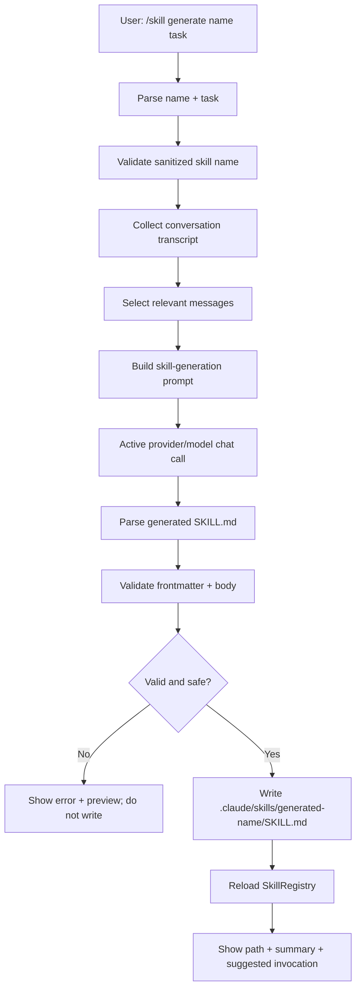

# Future Plan 03: Generate Skills From Conversation

## Scope

This report designs a feature where the user can ask forge to generate a new skill from the knowledge and workflow demonstrated in the current conversation. The currently active model should perform the extraction. The generated skill should be saved under the project skills directory and become available through the existing skills system.

## Current-State Findings

### Existing Skills System

Skills are loaded by `src/skills/mod.rs` from:

- Project: `./.claude/skills/<name>/SKILL.md`
- User: `~/.forge-osh/skills/<name>/SKILL.md`
- Bundled: compiled into the binary

Priority:

1. Project
2. User
3. Bundled

Skill frontmatter supports:

- `name`
- `description`
- `when_to_use`
- `allowed_tools`
- `model`
- `execution_mode`
- `user_invocable`
- `hooks`
- extra fields

Skill execution modes:

- `inline`: materialized prompt is returned into the current conversation and an active skill scope is installed.
- `fork`: skill runs in an isolated worker.

### Existing Skill Commands

`src/tui/mod.rs` currently supports:

- `/skills`
- `/skill <name> [args]`
- `/skill show <name>`
- `/skill new <name>`
- `/skill edit <name>`
- `/skill delete <name>`
- `/skill reload`
- `/skill path`
- `/skill off`

`/skill new <name>` calls `scaffold_project_skill()`, which creates a template `SKILL.md` under `.claude/skills/<name>/SKILL.md` and opens `$EDITOR`.

There is no AI-generated skill creation flow yet.

### Existing Conversation Data

The session contains:

- `session.history.messages()`
- `session.invoked_skills`
- `session.working_dir`
- provider/model ids
- active skill scope
- cost tracker

The active provider/model is available via `ProviderRouter`.

### Existing Compaction Pattern To Reuse

`src/agent/compaction.rs` already performs a model call over conversation history to produce a structured summary. The skill-generation feature should reuse the same architectural pattern:

- Build a transcript from selected messages.
- Send a specialized system prompt to the active provider/model.
- Validate the generated output.
- Write a file only after validation.

## Proposed User Interface

Add a slash command:

```text
/skill generate <name> --task <task description>
```

Simpler first version:

```text
/skill generate <name> <task description>
```

Examples:

```text
/skill generate rust-release-build remember how we debugged and released forge-osh on Windows with MSYS2
/skill generate compaction-debugging from the conversation section about compacted sessions
/skill generate ci-diagnosis derive a reusable CI failure triage workflow
```

Suggested aliases:

- `/skill gen <name> <task>`
- `/skill generate-from-conversation <name> <task>`

## Output Location

Use a generated-skills namespace under project skills:

```text
.claude/skills/generated/<name>/SKILL.md
```

However, current loader expects immediate children of `.claude/skills/<name>/SKILL.md`, not nested categories. Two options:

### Option A: Direct Project Skill Path

```text
.claude/skills/<name>/SKILL.md
```

Pros:

- Works with current loader unchanged.
- Skill is immediately invocable.

Cons:

- Generated and manually authored skills are mixed.

### Option B: Generated Prefix

```text
.claude/skills/generated-<name>/SKILL.md
```

Pros:

- Works with current loader.
- Clearly identifies generated skills.

Cons:

- Skill names are longer.

Recommended first implementation: Option B.

## Skill Generation Flow



## Conversation Selection

The hardest conceptual part is extracting the “specific part of the conversation which performed the task.”

### Phase 1: Simple, Correct Baseline

Use the full current conversation transcript, but instruct the model to focus only on the user-provided task description.

Pros:

- Simple.
- No missing context.

Cons:

- Expensive for long sessions.
- May include irrelevant details.

### Phase 2: Relevance Extraction

Before skill generation, run a lightweight selection step:

1. Convert messages into indexed transcript chunks.
2. Ask the current model:
   - Which message ranges are relevant to task X?
3. Use only those ranges for skill generation.

This uses the active model, as requested, but doubles API calls.

### Phase 3: Deterministic + Model Hybrid

Use deterministic filters first:

- User messages containing task keywords.
- Assistant messages after those user messages.
- Tool calls/files mentioned in those spans.
- Compaction summaries if present.
- Invoked skill records.

Then ask the model to refine.

Recommended implementation:

- Start with Phase 1, but architect the generator as `ConversationSkillSource` so Phase 2/3 can replace the source selection later.

## Prompt Contract For Skill Generation

The generation prompt should require exactly one `SKILL.md` document:

```markdown
---
name: generated-name
description: One sentence.
when_to_use: Concrete trigger conditions.
allowed_tools:
  - read_file
  - search_files
  - find_files
  - bash
execution_mode: inline
user_invocable: true
---

# Skill Title

...
```

The model must include:

- Purpose.
- When to use.
- Preconditions.
- Step-by-step workflow.
- Tool strategy.
- Verification strategy.
- Failure modes.
- Things not to do.
- Project-specific commands or paths only when genuinely learned from conversation.
- `${ARGS}` usage if the skill should accept arguments.

The model must not include:

- Secrets.
- Raw API keys.
- Private user data unless explicitly necessary and approved.
- Huge pasted transcripts.
- Claims that are not supported by the conversation.

## Validation Layer

Never write model output directly without validation.

Validation steps:

1. Ensure output contains parseable frontmatter.
2. Ensure sanitized `name` matches requested name or generated name policy.
3. Ensure `description` and `when_to_use` are present.
4. Ensure `execution_mode` is `inline` or `fork`.
5. Ensure `allowed_tools` is a list of known tools.
6. Reject dangerous allowed tools by default:
   - `delete_file`
   - `git_reset`
   - `git_push`
   - unrestricted shell if not necessary
7. Run existing `parse_markdown_skill()` or expose a validation helper.
8. Detect secret-looking strings.
9. Detect empty or too-short bodies.
10. Detect code fences wrapping the whole document and strip/reject.

## Current Active Model Requirement

The generation call must use the active provider/model at the time the command runs:

- Acquire router read lock.
- Use `router.active()` and `router.active_model_id()`.
- Do not use session creation-time model.
- Store generated metadata:
  - provider id
  - model id
  - generation timestamp
  - source session id

This mirrors the compaction bug class already fixed elsewhere: do not read stale `session.model_id` if the user has switched models.

## Proposed Types

```rust
pub struct SkillGenerationRequest {
    pub name: String,
    pub task: String,
    pub source: SkillGenerationSource,
}

pub enum SkillGenerationSource {
    FullConversation,
    LastMessages(usize),
    SinceMessage(usize),
}

pub struct GeneratedSkill {
    pub name: String,
    pub path: PathBuf,
    pub content: String,
    pub provider_id: String,
    pub model_id: String,
}
```

## Required Code Changes Later

- `src/skills/mod.rs`
  - Expose skill validation helper instead of keeping parsing fully private.
  - Add helper to build project skill path safely.
- `src/agent/skill_generation.rs` (new)
  - Build transcript.
  - Call active provider/model.
  - Validate model output.
  - Return generated skill content.
- `src/tui/mod.rs`
  - Add `/skill generate` command.
  - Show progress.
  - Write generated skill after validation.
  - Refresh shared skill registry.
- `src/types.rs`
  - Possibly no changes unless a shared generation request type is added.
- `src/agent/system_prompt.rs`
  - Add future instructions that the agent can generate skills through the slash command and should preserve reusable workflows.
- `src/tui/help.rs`
  - Document command.

## Safety And UX

Recommended command behavior:

1. Generate skill draft.
2. Save to `.claude/skills/generated-<name>/SKILL.md`.
3. Do not auto-invoke it.
4. Show:
   - Path.
   - Description.
   - Allowed tools.
   - How to invoke.
5. Suggest `/skill show <name>` and `/skill edit <name>`.

Optional safer variant:

- Preview first, ask user to confirm before writing.

## System Prompt Maintenance

After implementation, update the system prompt to include:

- Use `/skill generate` when the user asks to turn a solved workflow into a reusable skill.
- Generated skills must be validated and stored in project skills.
- Do not generate skills containing secrets or irrelevant transcript content.
- Prefer focused, reusable procedures over one-off narrative summaries.

## Tests Without Disk Bloat

Unit tests:

- Skill name sanitization.
- Generated path policy.
- Frontmatter validation.
- Reject unknown tools.
- Reject dangerous tool allowlist unless explicitly permitted.
- Parse generated valid skill.

Mock provider tests:

- Fake provider returns deterministic `SKILL.md`.
- Command writes expected file in temp dir.
- Registry reload finds generated skill.

Manual tests:

1. Generate skill from short conversation.
2. Generate skill with bad model output and verify no file write.
3. Generate skill with existing name and verify safe refusal.
4. Generate skill after model switch and verify active model used.
5. Invoke generated skill and verify allowed tools scope.

## Caveats

- Model-generated workflows can overfit to one conversation. Validation cannot prove conceptual quality.
- Long sessions may need compaction-aware transcript extraction.
- Generated skills can become stale if project commands change.
- A malicious conversation could try to inject unsafe skill instructions. The generator prompt and validator must treat transcript text as untrusted source material.

## Recommended Implementation Phases

1. Add validation helpers for `SKILL.md`.
2. Add generator module with mock-provider tests.
3. Add `/skill generate <name> <task>`.
4. Add preview/confirmation.
5. Add relevance extraction.
6. Add generated-skill metadata comments.
7. Update system prompt and help docs.

